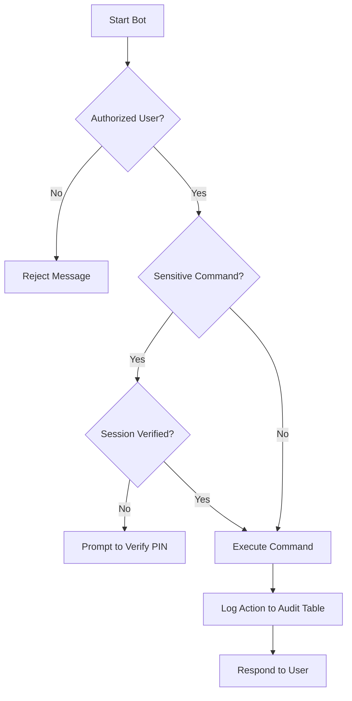

# WhatsApp Credential Bot

A personal WhatsApp bot for securely storing, encrypting, and managing credentials locally using PostgreSQL.

---

## 🚀 Features

- Store credentials via WhatsApp (`simpan <name> <value>`)
- Retrieve credentials (`lihat <name>`)
- Delete credentials (`hapus <name>`)
- Import & export credentials as `.txt` (JSON format)
- PIN system with session verification
- Automatic audit log for all commands
- Symmetric encryption using Node.js `crypto`
- Rate limiting for sensitive commands

---

## 🧱 Tech Stack

- Bun + TypeScript
- PostgreSQL
- [whatsapp-web.js](https://github.com/pedroslopez/whatsapp-web.js)
- Docker & Docker Compose

---

## ⚙️ How to Run

### 1. Clone the Repository
```bash
git clone https://github.com/yourname/whatsapp-credential-bot.git
cd whatsapp-credential-bot
```

### 2. Run with Docker
```bash
docker compose up --build
```

### 3. Or Run with Bun Runtime
```bash
bun install
bun run dev
```

---

## 🛠️ Database Setup

You can use the existing `init.sql` located in `src/db/init.sql`.

With Docker, the bot will automatically:
- Install dependencies
- Build TypeScript to JavaScript (`dist/`)
- Run the bot and PostgreSQL database
- Create required tables using `init.sql`

### 4. Scan QR Code
Check the terminal. Scan the displayed QR code using your WhatsApp to log in.

---

## 🔄 Flow Diagram



---

## 🔐 Example Commands

| Command                        | Description                           |
|-------------------------------|---------------------------------------|
| `simpan <credential name> <value>` | Save a credential                    |
| `lihat <credential name>`         | Retrieve a saved credential          |
| `hapus <credential name>`         | Delete a credential                  |
| `list`                           | List all saved credentials           |
| `export`                         | Export all credentials (as file)     |
| Send `.txt` file                 | Import data from backup              |
| `setpin <pin>`                   | Set your private PIN                 |
| `verifikasi <pin>`              | Verify current PIN session           |
| `logout`                         | Logout from current PIN session      |
| `status`                         | Check current session status         |
| `riwayat`                        | View recent command history          |
| `bantuan, menu, atau ?`                        | View all available command          |

---

## 📁 Folder Structure

```
.
├── src/
│   ├── bot/             # Bot logic and commands
│   ├── db/              # PostgreSQL client
│   ├── utils/           # Crypto, pin, session, audit
├── dist/                # Compiled build output
├── db/init.sql          # Table creation script
├── Dockerfile
├── docker-compose.yml
├── .dockerignore
├── tsconfig.json
```

---

## 📝 Notes

- Only whitelisted numbers are allowed to interact with the bot
- All credential data is encrypted using symmetric encryption (keep `ENCRYPTION_KEY` secure)
- Login QR codes are saved in the `.wwebjs_auth/` directory
- PIN verification currently lacks session-aware optimization; repeated verification may create multiple session rows in the database

---

## 🤝 Contributing

Contributions are welcome! Here's how you can help:

1. Fork this repository
2. Create a new branch
   ```bash
   git checkout -b feature/your-feature-name
   ```
3. Make your changes and test them locally
4. Commit and push to your fork
5. Open a pull request (PR) describing your changes

Please follow the coding conventions already in place and write clean, understandable commits. Contributions related to testing, security, and extensibility are highly appreciated!

---

## 📌 License

MIT License

---

## 🙋🏻‍♂️ Created by

> Ibnu Alinsani ✨  
> Designed for secure personal and local use only
